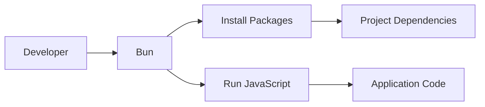
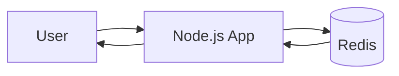
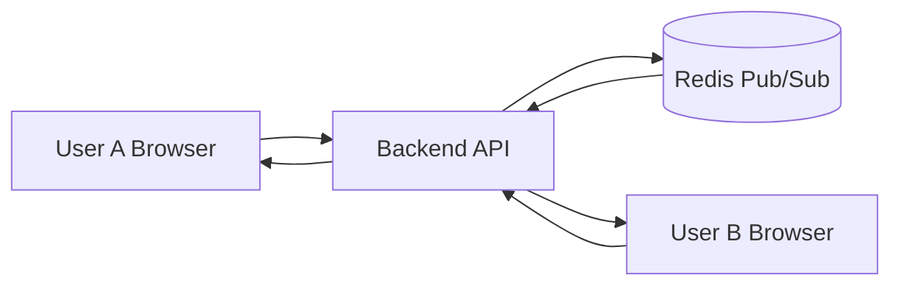
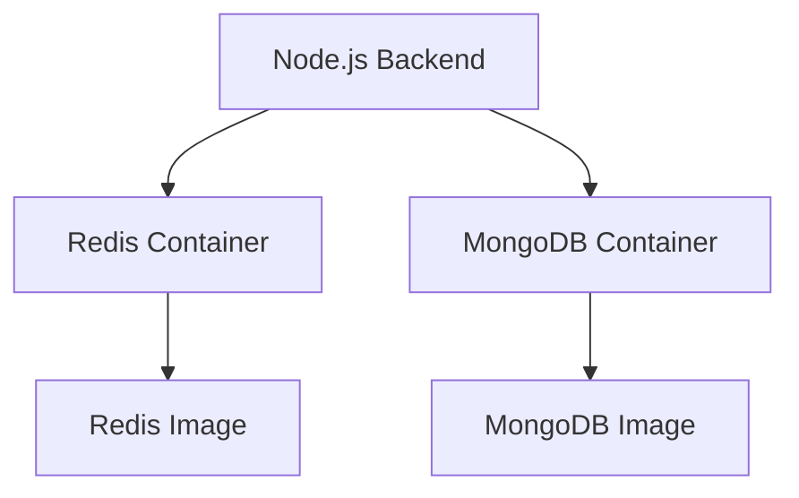
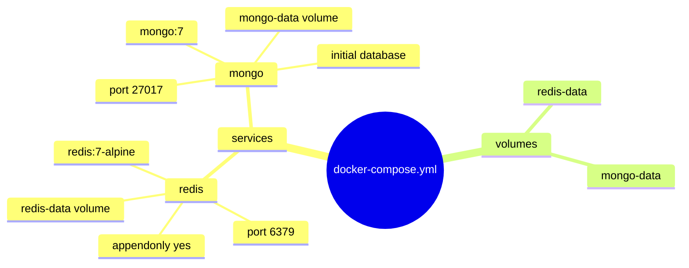
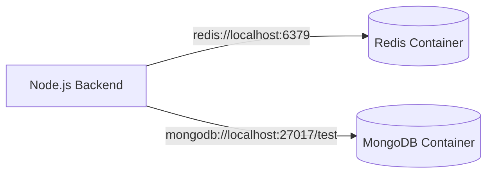
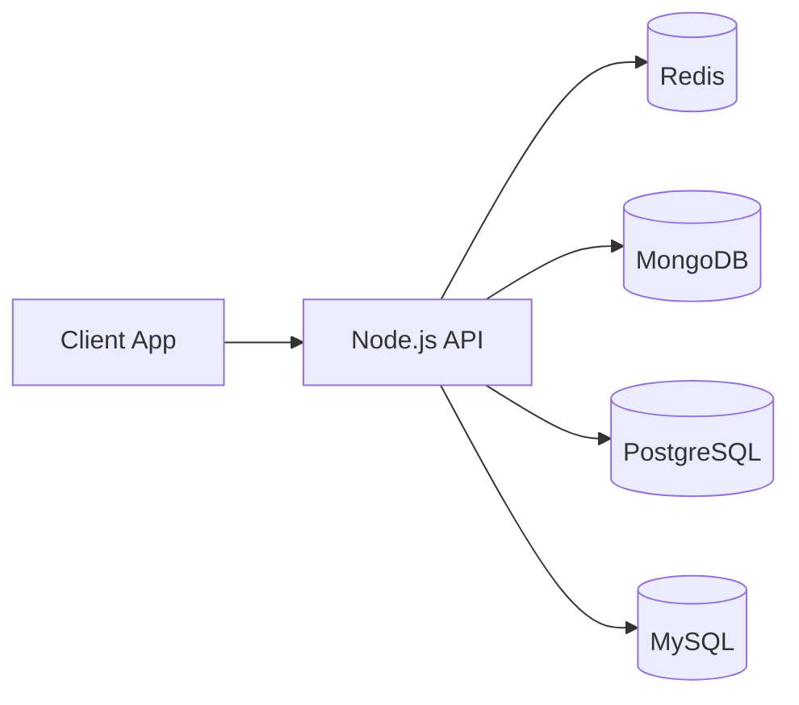

# Redis 

This project shows how a Node.js backend can talk to Redis and MongoDB while those databases run locally in Docker containers.

## Table of Contents

- [What This Project Does](#what-this-project-does)
- [About Bun](#about-bun)
- [What Redis Is](#what-redis-is)
- [Why Redis Is Useful](#why-redis-is-useful)
- [Redis in Realtime Applications](#redis-in-realtime-applications)
- [Docker And Docker Compose](#docker-and-docker-compose)
- [Your Docker Compose File Explained Line By Line](#your-docker-compose-file-explained-line-by-line)
- [How The App Connects To Redis And MongoDB](#how-the-app-connects-to-redis-and-mongodb)
- [Redis With Other Databases](#redis-with-other-databases)
- [When To Use Redis](#when-to-use-redis)
- [How To Run This Project](#how-to-run-this-project)
- [Project File Overview](#project-file-overview)
- [Key Learning Summary](#key-learning-summary)

## What This Project Does

- Starts a Node.js server from `src/index.js`
- Connects to Redis
- Connects to MongoDB
- Uses Docker Compose to run Redis and MongoDB locally

## About Bun

Bun is a JavaScript runtime and package manager that can also act as a bundler and test runner.

In simple words, Bun tries to do several developer tasks in one tool:

- run JavaScript files
- install packages
- bundle code for production
- run tests

### Why People Use Bun

Bun is popular because it is fast and convenient.

It can be useful when you want:

- quicker dependency installation
- a single tool for install, build, and test workflows
- a modern developer experience

### Bun As Package Manager

When you run commands like `bun install` or `bun add express`, Bun is acting like npm.

That means it can:

- read your package manifest
- download packages
- create or update a lockfile
- manage dependencies for the project

### Bun As Runtime

Bun can also run JavaScript files directly, similar to Node.js.

For example:

- `bun src/index.js`
- `bun run dev`

### Bun In This Project

In this project, Bun was useful for package installation, but Node.js is used as the runtime for the server.

Why:

- the project uses Mongoose
- Mongoose depends on MongoDB internals
- some MongoDB internals can require Node-specific behavior that Bun may not fully support in every case

So the practical setup here is:

- Bun for package management when needed
- Node.js for running the backend server

### Bun vs Node.js

| Feature | Bun | Node.js |
|---|---|---|
| Main role | Runtime + package manager + bundler | Runtime |
| Package install | Built in | Uses npm/pnpm/yarn |
| Server execution | Can run JS files | Runs JS files |
| Ecosystem maturity | Newer | Very mature |
| Compatibility | Still growing | Widest compatibility |

### Simple Bun Flow



## What Redis Is

Redis is an in-memory data store.

It is commonly used for:

- caching
- session storage
- rate limiting
- job queues
- pub/sub messaging
- realtime counters and live updates

Redis is fast because it keeps data in memory instead of reading everything from disk all the time.

## Why Redis Is Useful

Redis is useful when your app needs:

- very fast reads and writes
- temporary data storage
- realtime communication
- shared state across multiple servers

### Simple Redis Flow



## Redis in Realtime Applications

Redis is often used in realtime systems because it can respond very quickly and can also help different parts of an app communicate.

### Example Uses

- chat message delivery
- live notifications
- leaderboard updates
- online user tracking
- socket session storage

### Realtime App Diagram



In a realtime app, Redis can act like a fast middle layer that helps the backend push events to connected clients.

## Docker And Docker Compose

Docker lets you run software inside containers.

Docker Compose lets you define and start multiple containers together with one file.

In this project, Docker Compose runs:

- Redis container
- MongoDB container

Your Node.js app connects to them using `localhost`.

### Main Idea



## How Docker Compose Helps

Without Docker Compose, you would need to:

- install Redis manually
- install MongoDB manually
- start each service yourself
- manage ports and persistence separately

With Docker Compose, one command starts everything.

## Your Docker Compose File Explained Line By Line

Your current file is:

```yaml
services:
    redis:
      image: redis:7-alpine
      container_name: redis-Abhinav
      ports:
        - "6379:6379"
      command: ["redis-server", "--appendonly", "yes"]
      volumes:
        - redis-data:/data

    mongo:
      image: mongo:7
      container_name: mongo-Abhinav
      ports:
        - "27017:27017"
      environment:
        MONGO_INITDB_DATABASE: redis-practice
      volumes:
        - mongo-data:/data/db

volumes:
  redis-data:
  mongo-data:
```

### Explanation

| Line | Meaning |
|---|---|
| `services:` | Starts the section where Docker Compose defines containers. |
| `redis:` | Creates a service named `redis`. |
| `image: redis:7-alpine` | Uses the Redis 7 Alpine Docker image. |
| `container_name: redis-Abhinav` | Gives the Redis container a fixed name. |
| `ports:` | Exposes container ports to your machine. |
| `- "6379:6379"` | Maps local port 6379 to Redis port 6379 in the container. |
| `command: ["redis-server", "--appendonly", "yes"]` | Starts Redis with append-only persistence enabled. |
| `volumes:` | Stores Redis data on disk so it survives restarts. |
| `- redis-data:/data` | Persists Redis data inside the `redis-data` volume. |
| `mongo:` | Creates a second service named `mongo`. |
| `image: mongo:7` | Uses the MongoDB 7 Docker image. |
| `container_name: mongo-Abhinav` | Gives the MongoDB container a fixed name. |
| `- "27017:27017"` | Maps local port 27017 to MongoDB port 27017 in the container. |
| `environment:` | Passes environment variables to MongoDB. |
| `MONGO_INITDB_DATABASE: redis-practice` | Creates the initial MongoDB database name. |
| `- mongo-data:/data/db` | Persists MongoDB data inside the `mongo-data` volume. |
| `volumes:` at the bottom | Declares named Docker volumes used by the services. |
| `redis-data:` | Declares a named volume for Redis. |
| `mongo-data:` | Declares a named volume for MongoDB. |

### Compose File Mind Map



## How The App Connects To Redis And MongoDB

Your Node.js code uses default local connection strings:

- Redis: `redis://localhost:6379`
- MongoDB: `mongodb://localhost:27017/test`

That works because Docker Compose publishes the container ports to your machine.

### Connection Diagram



## Redis With Other Databases

Redis is not a replacement for MongoDB, PostgreSQL, or MySQL.

Instead, Redis is usually used together with them.

### With MongoDB

MongoDB stores the main documents.
Redis stores cached copies, temporary state, sessions, or counters.

Example:

- MongoDB stores user profiles
- Redis stores the currently logged-in session
- Redis also stores recent API results for speed

### With PostgreSQL

PostgreSQL stores relational data.
Redis can be used for:

- cache
- rate limiting
- job queues
- realtime updates

Example:

- Postgres stores orders
- Redis stores order status updates or cache for common queries

### With MySQL

MySQL works in a similar way to PostgreSQL in this pattern.

Example:

- MySQL stores product data
- Redis stores popular product cache
- Redis stores shopping cart session data

### Multi-Database Architecture



## When To Use Redis

Use Redis when you need:

- speed
- short-lived data
- shared cache
- realtime messaging
- fast counters
- sessions

Do not use Redis alone when you need:

- complex relational queries
- long-term persistent business records
- strong transactional database design

## How To Run This Project

### Start Docker Services

```bash
docker compose up -d
```

### Check Running Containers

```bash
docker compose ps
```

### View Logs

```bash
docker compose logs -f
```

### Start The Node Server

```bash
npm run dev
```

### Test The API

```bash
curl http://localhost:3000/
curl http://localhost:3000/mongo
```

## Project File Overview

- `docker-compose.yml` starts Redis and MongoDB
- `src/index.js` creates the Node.js server and connects to the databases
- `package.json` defines the project dependencies and scripts

## Key Learning Summary

- Node.js runs your backend server
- Docker runs Redis and MongoDB locally
- Docker Compose starts both services together
- Redis is used for fast temporary data and realtime patterns
- MongoDB, PostgreSQL, and MySQL are used for persistent application data
- Redis can work alongside those databases as a cache or realtime layer
