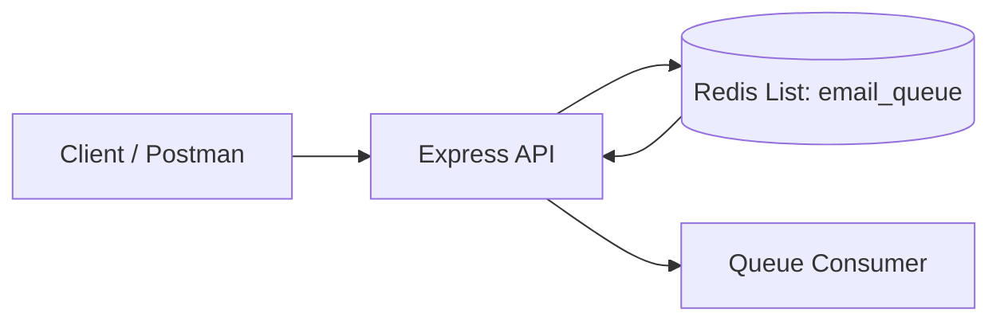

# Email Queue With Redis

This project shows a simple email queue built with Node.js, Express, and Redis. It demonstrates how to push email jobs into a Redis-backed queue and retrieve them later in FIFO order.

## What This Project Does

- Starts an Express server from `src/index.js`
- Connects to Redis using `ioredis`
- Adds email jobs to a Redis list with `LPUSH`
- Retrieves queued jobs with `RPOP`
- Exposes a small API for testing the queue flow

## Why Redis Is Used

Redis is a strong fit for queues because it is fast, supports list operations, and works well for temporary job storage.

In this project, Redis acts as the queue store:

- new email jobs are added to the left side of the list
- jobs are removed from the right side of the list
- this keeps the queue behavior consistent and ordered

## Project Structure

```text
email-queue/
├── docker-compose.yml
├── package.json
├── README.md
└── src/
    └── index.js
```

## API Endpoints

### 1) Health Check / Redis Ping

- Method: `GET`
- Path: `/`
- Purpose: confirm the server is running and Redis is reachable

Example response:

```json
{
  "message": "Redis ping response: PONG"
}
```

### 2) Add Email To Queue

- Method: `POST`
- Path: `/email`
- Purpose: store an email job in Redis

Request body:

```json
{
  "to": "test@example.com",
  "subject": "Hello",
  "body": "This is a test email"
}
```

Example response:

```json
{
  "message": "Email added to queue"
}
```

The server automatically adds a `createdAt` timestamp before saving the job.

### 3) Get Email From Queue

- Method: `GET`
- Path: `/email`
- Purpose: remove and return the next email job from the queue

Example response when a job exists:

```json
{
  "message": "Email retrieved from queue",
  "job": {
    "to": "test@example.com",
    "subject": "Hello",
    "body": "This is a test email",
    "createdAt": "2026-07-04T17:11:16.164Z"
  }
}
```

Example response when the queue is empty:

```json
{
  "message": "No emails in queue"
}
```

## Queue Behavior

The app uses a Redis list named `email_queue`.

- `LPUSH email_queue` adds a new job
- `RPOP email_queue` removes the oldest job

That means jobs are processed in the same order they were added.



## Setup

### Prerequisites

- Node.js installed
- Docker installed
- Docker Compose available

### Install Dependencies

From the `email-queue` folder:

```bash
npm install
```

### Start Redis

This project includes a Docker Compose file that starts Redis and MongoDB.
Redis is required for the queue API.

```bash
docker compose up -d
```

### Start The App

```bash
npm start
```

By default, the app runs on port `3000`.

## Environment Variables

The app supports one Redis connection setting:

- `REDIS_URL` - optional Redis connection string

If `REDIS_URL` is not set, the app uses:

```text
redis://localhost:6379
```

## Test Examples

### Test Redis Connection

```bash
curl http://localhost:3000/
```

### Add An Email Job

```bash
curl -X POST http://localhost:3000/email \
  -H "Content-Type: application/json" \
  -d '{"to":"test@example.com","subject":"Hello","body":"This is a test email"}'
```

### Get The Next Email Job

```bash
curl http://localhost:3000/email
```

### Check Queue After Emptying It

```bash
curl http://localhost:3000/email
```

## Notes

- The server now uses `express.json()` so JSON request bodies are parsed correctly.
- The project includes `mongoose` in `package.json`, but the current email queue flow does not use MongoDB.
- The Docker Compose file starts MongoDB as well, but the queue example itself depends on Redis.

## Summary

This is a minimal Redis queue example that is useful for learning how to:

- push work into a queue
- consume work later
- keep job data in Redis
- test simple API-driven queue behavior