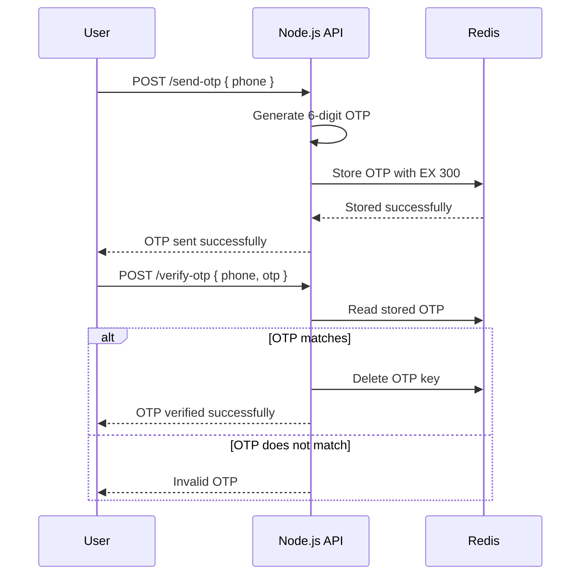
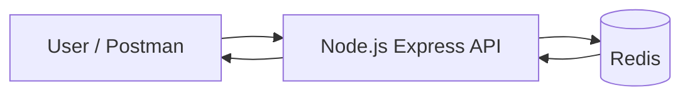
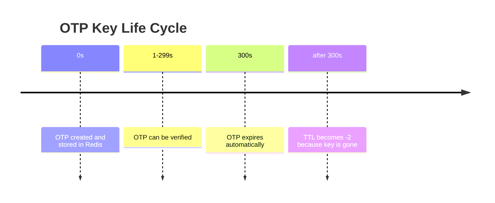

# Login OTP With TTL

This project demonstrates a simple OTP login flow built with Node.js and Redis. It shows how to generate an OTP, store it with a time-to-live (TTL), verify it, and automatically expire it after a short period.

## What This Project Teaches

- How OTP-based authentication works
- How Redis can store temporary data
- How TTL automatically removes expired data
- How to build and test API routes with Postman
- How to reason about request flow, validation, and expiry

## Table Of Contents

- [Project Overview](#project-overview)
- [How The OTP Flow Works](#how-the-otp-flow-works)
- [Why Redis Is Used](#why-redis-is-used)
- [Architecture Diagram](#architecture-diagram)
- [Redis TTL Concept](#redis-ttl-concept)
- [API Endpoints](#api-endpoints)
- [Request And Response Examples](#request-and-response-examples)
- [Folder Structure](#folder-structure)
- [Setup And Run](#setup-and-run)
- [Postman Testing](#postman-testing)
- [Troubleshooting](#troubleshooting)
- [Key Concepts Summary](#key-concepts-summary)

## Project Overview

The app exposes three endpoints:

- `POST /send-otp` to generate and store an OTP
- `POST /verify-otp` to validate the OTP
- `GET /otp/:phone/ttl` to inspect remaining TTL for the OTP key

The OTP is stored in Redis with a 5 minute expiration. If the OTP is not verified within that time, Redis removes it automatically.

## How The OTP Flow Works



The flow is intentionally short-lived. That is the point of OTP: use it once, verify quickly, and expire it automatically.

## Why Redis Is Used

Redis is a good fit for OTP storage because it is fast and supports expiration natively.

Redis helps here because it:

- stores temporary values in memory
- supports key expiration with TTL
- deletes expired keys automatically
- allows simple read, write, and delete operations

This is better than storing OTPs in a permanent database because OTPs are not meant to live long.

## Architecture Diagram



Only Redis is required for the current app logic. The project folder also contains Docker Compose and MongoDB setup from earlier practice, but the OTP routes themselves use Redis.

## Redis TTL Concept

TTL means time to live. It is the number of seconds a Redis key is allowed to exist before Redis removes it.

In this app:

- OTP is stored with `EX 300`
- `300` seconds equals 5 minutes
- after 5 minutes, the key expires automatically



Important TTL behavior:

- `ttl > 0` means the key exists and has time remaining
- `ttl = -1` means the key exists but has no expiration
- `ttl = -2` means the key does not exist

## API Endpoints

### 1) Send OTP

- Method: `POST`
- Path: `/send-otp`
- Purpose: generate a 6 digit OTP and store it in Redis

Request body:

```json
{
  "phone": "9876543210"
}
```

Success response:

```json
{
  "message": "OTP sent successfully 123456"
}
```

Error response when phone is missing:

```json
{
  "error": "Phone number is required"
}
```

### 2) Verify OTP

- Method: `POST`
- Path: `/verify-otp`
- Purpose: compare user input with stored OTP

Request body:

```json
{
  "phone": "9876543210",
  "otp": "123456"
}
```

Success response:

```json
{
  "message": "OTP verified successfully"
}
```

Error response when OTP does not match:

```json
{
  "error": "Invalid OTP"
}
```

Validation error when body fields are missing:

```json
{
  "error": "Phone number and OTP are required"
}
```

### 3) Check OTP TTL

- Method: `GET`
- Path: `/otp/:phone/ttl`
- Purpose: check how much time is left for the stored OTP key

Example:

```text
GET /otp/9876543210/ttl
```

Response while OTP is alive:

```json
{
  "ttl": 300
}
```

Response after OTP is deleted or expired:

```json
{
  "ttl": -2
}
```

## Request And Response Examples

### Send OTP

```http
POST http://localhost:3000/send-otp
Content-Type: application/json

{
  "phone": "9876543210"
}
```

### Verify OTP With Wrong Code

```http
POST http://localhost:3000/verify-otp
Content-Type: application/json

{
  "phone": "9876543210",
  "otp": "000000"
}
```

### Verify OTP With Correct Code

Replace `123456` with the OTP returned by `/send-otp`.

```http
POST http://localhost:3000/verify-otp
Content-Type: application/json

{
  "phone": "9876543210",
  "otp": "123456"
}
```

### Check TTL

```http
GET http://localhost:3000/otp/9876543210/ttl
```

## Folder Structure

```text
login-otp-with-ttl/
├── docker-compose.yml
├── package.json
├── README.md
└── src/
    └── index.js
```

## Setup And Run

### 1) Install dependencies

You already used Bun in this project. You can install dependencies with:

```bash
bun install
```

### 2) Start Redis and MongoDB containers

The compose file defines Redis and MongoDB containers.

```bash
docker compose up -d
```

### 3) Start the app

```bash
npm run dev
```

### 4) Test the API

Use Postman or the requests shown above.

## Postman Testing

### Send OTP

- Method: `POST`
- URL: `http://localhost:3000/send-otp`
- Body: raw JSON

```json
{
  "phone": "9876543210"
}
```

### Verify OTP

- Method: `POST`
- URL: `http://localhost:3000/verify-otp`
- Body: raw JSON

```json
{
  "phone": "9876543210",
  "otp": "123456"
}
```

### Check TTL

- Method: `GET`
- URL: `http://localhost:3000/otp/9876543210/ttl`

## Code Explanation

### Express Setup

The server uses Express to define routes and parse JSON bodies.

### Redis Connection

The Redis client connects to `redis://localhost:6379` by default. You can override it with `REDIS_URL`.

### OTP Key Format

OTP keys are stored with the pattern:

```text
opt:<phone>
```

For example:

```text
opt:9876543210
```

This makes each phone number map to its own OTP key.

### OTP Generation

The app generates a random 6 digit OTP using JavaScript math.

### OTP Storage

The OTP is saved in Redis with:

```js
redis.set(key, value, "EX", 300)
```

That means:

- `EX` sets the expiration in seconds
- `300` means 5 minutes

### OTP Verification

The server:

1. reads the OTP from Redis
2. compares it with the user input
3. deletes the key if it matches
4. returns an error if it does not match

### TTL Check

The `ttl` command tells you how long the key will still exist in Redis.

## Troubleshooting

### Problem: 500 error with `req.body` undefined

Cause: the request body was missing or not sent as JSON.

Fix:

- set `Content-Type: application/json`
- send a JSON body in Postman
- use `raw` body mode

This project now guards against missing bodies and returns a clean validation error.

### Problem: OTP verification fails

Common reasons:

- wrong OTP value
- OTP already expired
- OTP already verified and deleted
- phone number does not match the OTP key

### Problem: TTL is `-2`

This means the key is gone. That can happen because:

- the OTP was verified and deleted
- the OTP expired naturally after 5 minutes

## Key Concepts Summary

- Redis is used as a temporary store for OTP values
- OTPs should expire quickly for security
- TTL makes expiration automatic
- `/send-otp` creates the OTP
- `/verify-otp` checks the OTP and deletes it if valid
- `/otp/:phone/ttl` helps inspect expiry status
- Postman must send JSON correctly or the API will reject the request

## Learning Outcome

After understanding this project, you should be able to explain:

- why OTPs are temporary
- how Redis TTL works
- how to structure a simple verification flow
- how to test APIs with Postman
- how to reason about request validation and error handling
