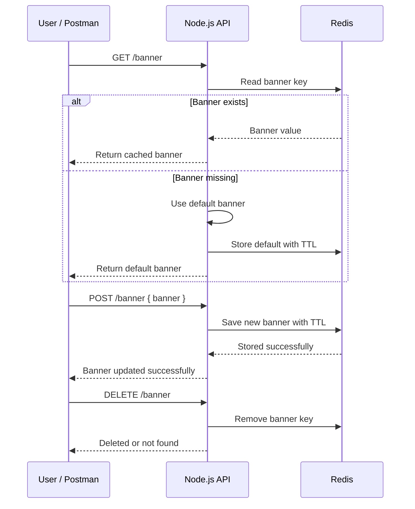
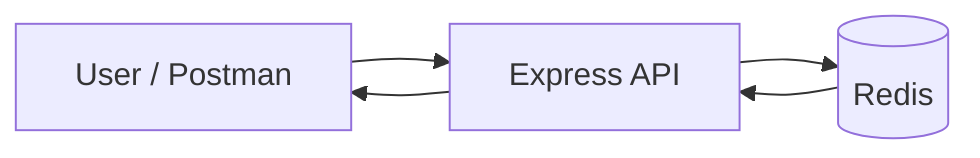
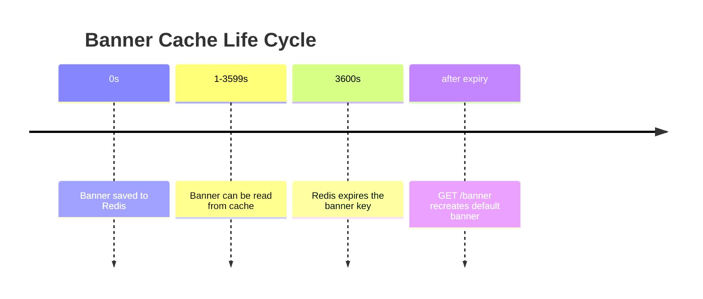

# Site Banner With Redis Cache

This project demonstrates a small Node.js API that stores a banner message in Redis with expiration. It is a practical example of cache-first reads, temporary storage, and simple REST APIs.

## What This Project Teaches

- How Redis can cache a single value
- How to use TTL for temporary content
- How to build a banner API with Express
- How to test endpoints with Postman
- How to think about cache read, write, delete, and expiry flows

## Table Of Contents

- [Project Overview](#project-overview)
- [How The Banner Flow Works](#how-the-banner-flow-works)
- [Why Redis Is Used](#why-redis-is-used)
- [Architecture Diagram](#architecture-diagram)
- [Cache Expiration Concept](#cache-expiration-concept)
- [API Endpoints](#api-endpoints)
- [Request And Response Examples](#request-and-response-examples)
- [Folder Structure](#folder-structure)
- [Setup And Run](#setup-and-run)
- [Postman Testing](#postman-testing)
- [Troubleshooting](#troubleshooting)
- [Key Concepts Summary](#key-concepts-summary)

## Project Overview

The app exposes four banner-related endpoints:

- `GET /banner` to read the banner from Redis
- `POST /banner` to update the banner and cache it
- `DELETE /banner` to remove the banner from Redis
- `GET /banner/exists` to check whether the banner key exists

The banner is cached in Redis with a TTL of 1 hour.

If the banner is missing, the app simulates a database fetch and stores a default banner message:

```text
Welcome to our website!
```

## How The Banner Flow Works



## Why Redis Is Used

Redis is a good fit here because the banner is a temporary, frequently read value.

Redis helps because it:

- returns values very quickly
- supports automatic expiration
- makes it easy to update or remove a cached banner
- avoids repeated work when the banner is already known

This is a cache pattern, not a permanent database pattern.

## Architecture Diagram



The API is the middle layer. It reads and writes the banner in Redis.

## Cache Expiration Concept

The banner is written with a TTL of 1 hour.

That means:

- the banner can be read immediately after saving
- Redis automatically expires it later
- the app can repopulate it with a default value if needed



TTL behavior in Redis:

- `ttl > 0` means the banner key exists and still has time left
- `ttl = -1` means the key exists but has no expiration
- `ttl = -2` means the key does not exist

## API Endpoints

### 1) Get Banner

- Method: `GET`
- Path: `/banner`
- Purpose: read the current banner from Redis

If the banner exists:

```json
{
  "banner": "Hello from Redis"
}
```

If the banner does not exist, the app returns the default value and caches it:

```json
{
  "banner": "Welcome to our website!"
}
```

### 2) Update Banner

- Method: `POST`
- Path: `/banner`
- Purpose: store a new banner in Redis

Request body:

```json
{
  "banner": "Hello from Postman"
}
```

Success response:

```json
{
  "message": "Banner updated successfully",
  "banner": "Hello from Postman"
}
```

Validation error when banner is missing:

```json
{
  "error": "Banner content is required"
}
```

### 3) Delete Banner

- Method: `DELETE`
- Path: `/banner`
- Purpose: remove the banner key from Redis

Success response:

```json
{
  "message": "Banner deleted successfully"
}
```

If the banner key is not present:

```json
{
  "error": "Banner not found"
}
```

### 4) Check Banner Existence

- Method: `GET`
- Path: `/banner/exists`
- Purpose: check whether the banner key exists in Redis

Example response when the banner exists:

```json
{
  "success": true,
  "exists": true
}
```

Example response when the banner does not exist:

```json
{
  "success": true,
  "exists": false
}
```

## Request And Response Examples

### Get Banner

```http
GET http://localhost:3000/banner
```

### Update Banner

```http
POST http://localhost:3000/banner
Content-Type: application/json

{
  "banner": "Hello from Postman"
}
```

### Delete Banner

```http
DELETE http://localhost:3000/banner
```

### Check Banner Exists

```http
GET http://localhost:3000/banner/exists
```

## Folder Structure

```text
site-banner/
├── docker-compose.yml
├── package.json
├── README.md
└── src/
    └── index.js
```

## Setup And Run

### 1) Install dependencies

```bash
bun install
```

### 2) Start Redis and MongoDB containers

This project includes a compose file for the database services.

```bash
docker compose up -d
```

### 3) Start the app

```bash
npm run dev
```

### 4) Test the API

Use Postman, browser, or the `http` requests above.

## Postman Testing

### Get Banner

- Method: `GET`
- URL: `http://localhost:3000/banner`

### Update Banner

- Method: `POST`
- URL: `http://localhost:3000/banner`
- Body: raw JSON

```json
{
  "banner": "Hello from Postman"
}
```

### Delete Banner

- Method: `DELETE`
- URL: `http://localhost:3000/banner`

### Check Banner Exists

- Method: `GET`
- URL: `http://localhost:3000/banner/exists`

## Code Explanation

### Express Setup

The app uses Express to define routes and handle JSON requests.

### Redis Client

The Redis client connects to `redis://localhost:6379` by default.

You can override it with `REDIS_URL` if needed.

### Banner Key

The banner is stored in Redis with the key:

```text
banner
```

### Cache Read Flow

When `GET /banner` runs:

1. the app checks Redis for `banner`
2. if found, it returns the cached value
3. if not found, it uses the default banner
4. it stores that default in Redis for 1 hour

### Cache Write Flow

When `POST /banner` runs:

1. the app reads `banner` from the request body
2. if missing, it returns a validation error
3. if present, it stores the value in Redis with TTL

### Delete Flow

When `DELETE /banner` runs:

1. the app removes the `banner` key from Redis
2. if the key existed, it returns success
3. if the key was missing, it returns `404`

### Exists Flow

When `GET /banner/exists` runs:

1. the app checks Redis for the `banner` key
2. it converts the Redis result into a boolean
3. it returns whether the banner exists

## Troubleshooting

### Problem: 500 error on POST /banner

Cause: the request body is missing or not sent as JSON.

Fix:

- set `Content-Type: application/json`
- use raw JSON body in Postman
- send a `banner` field

### Problem: Banner not updating

Common reasons:

- request body is empty
- wrong content type
- Redis container is not running

### Problem: Banner keeps returning old value

Possible causes:

- Redis still has the old cached key
- the key has not expired yet

Use `DELETE /banner` to clear it first.

### Problem: Docker compose conflicts

If Docker says the container name is already in use, another container with the same fixed name is still running or exists.

Use:

```bash
docker ps -a
```

and remove the stale container if needed.

## Key Concepts Summary

- Redis is used as a short-term cache for a banner message
- TTL automatically removes stale banner data
- `GET /banner` reads cached data or repopulates default data
- `POST /banner` updates the banner value
- `DELETE /banner` removes the banner key
- `GET /banner/exists` checks whether the key is present
- Postman must send JSON correctly for write requests

## Learning Outcome

After studying this project, you should be able to explain:

- how a cache-first API works
- how Redis TTL behaves
- how to store and delete temporary data
- how to test CRUD-like behavior in Postman
- how to document a small backend project clearly
